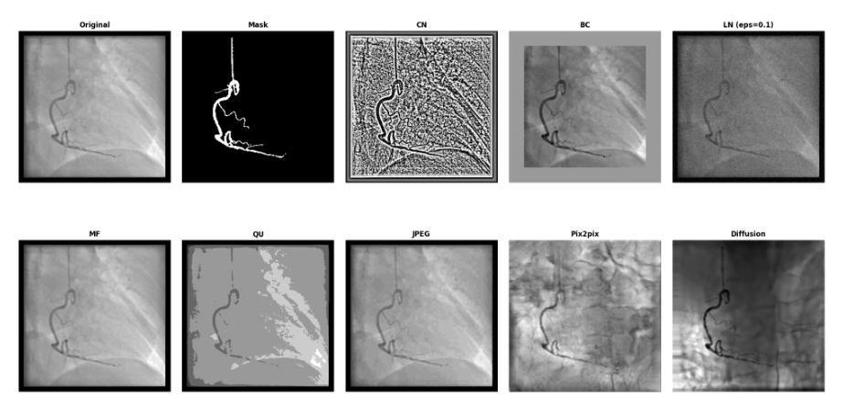

# Mask-Conditioned Generative Reconstruction of Vascular Angiography as Forensic Obfuscation

**Repository for the ISD 2026 full paper submission.**

This repository contains the official code, training and evaluation scripts for our proposed forensic obfuscation pipeline. Our method synthesizes Coronary X-ray Angiograms conditioned on binary vessel masks using Pix2Pix and Diffusion models. This process eliminates the images of hardware-specific forensic signatures, mitigating Attribute Inference Attacks while preserving the vascular structures necessary for downstream clinical diagnosis.



---

## Repository Setup

The following commands will initialize the enviroment.
```bash
uv sync
uv pip install -e .
export ATTACK_PREFIX=scripts/experiments/attacks
```

Model checkpoint paths are configured in `src/angio_gen/config/weights.yaml`. Update that file to match the local locations of the trained models before running the testing or evaluation scripts. The YAML currently stores the paths for the Pix2Pix, Diffusion, classifier and binary segmentation checkpoints.

## Pipeline execution

Before running any training job, make sure ClearML is configured. The training entrypoints initialize ClearML automatically, and we recommend using it to track experiments, metrics, and checkpoints.


**Step 1. Data fetching and splitting**

```
# Fetch the ARCADE dataset
./scripts/data/fetch_arcade.sh

# Prepare data splits for the AIA hospital classifiers
uv run scripts/data/make_classifier_dataset.py

# Prepare data splits for the generative reconstruction models
uv run scripts/data/make_regeneration_dataset_icanj.py
```

**Step 2. Anonymizer model training**

Train the core generative models to reconstruct angiograms from binary masks.
```
# Train the Pix2Pix model
uv run scripts/train/train_cgan.py

# Train the Diffusion model
uv run scripts/train/train_diffusion.py
```

The `scripts/test` folder contains lightweight entrypoints for model checks and smoke tests.

```
# Test the Pix2Pix model
uv run scripts/test/test_cgan.py

# Test the Diffusion model
uv run scripts/test/test_diffusion.py
```

**Step 3. Construct anonymized datasets**

Generate the sanitized datasets. Also generate baseline datasets using standard image augmentations for comparative evaluation.

```
# Generate images using the trained Pix2Pix model
uv run "$ATTACK_PREFIX"/make_anonymized_dataset_cgan.py

# Generate images using the trained Diffusion model
uv run "$ATTACK_PREFIX"/make_anonymized_dataset_diffusion.py

# Generate the baseline augmented datasets (Border Cropping, LN, CN, etc.)
uv run "$ATTACK_PREFIX"/make_anonymized_datasets_simple.py
```

**Step 4. Attack & Evaluation**

Train the adversarial hospital classifiers on both the original and anonymized datasets to measure the success rate of the Attribute Inference Attacks.

```
uv run "$ATTACK_PREFIX"/train_hospital_classifiers.py
```

Run the downstream clinical utility tests, performance benchmarks, and interpretability analyses.

```
# Evaluate the preservation of diagnostic utility via segmentation F1 scores
uv run scripts/experiments/test_binary_segmentation.py

# Measure inference latency for scalability assessment
uv run "$ATTACK_PREFIX"/measure_inference_time.py

# Calculate Classwise Energy Distance (CED) to assess source-invariant distributions
uv run "$ATTACK_PREFIX"/check_distributions.py

# Generate Grad-CAM visualizations to identify specific areas of forensic leakage
uv run "$ATTACK_PREFIX"/apply_gradcam.py

# Generate standard Saliency Maps for model interpretability
uv run "$ATTACK_PREFIX"/apply_saliency_maps.py
```

## Citation

If you use this work in your research, please cite our paper (details to be added upon publication).

